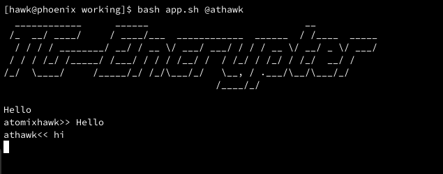

<pre>
  ____________      ______                            __           
 /_  __/ ____/     / ____/___  ____________  ______  / /____  _____
  / / / / ________/ __/ / __ \/ ___/ ___/ / / / __ \/ __/ _ \/ ___/
 / / / /_/ /_____/ /___/ / / / /__/ /  / /_/ / /_/ / /_/  __/ /    
/_/  \____/     /_____/_/ /_/\___/_/   \__, / .___/\__/\___/_/     
                                      /____/_/                    
  </pre>
  
 # Usage
 ## Todo
 
 Replace api id and hash with your own obtained from https://my.telegram.org/auth in all the python files
 
 Install dependencies pip(pyfiglet, telethon etc)
 
 # To run
 
 run `python init_send.py` and `python init_rec.py` and signin to telegram using your phone numbers
 
 run `bash app.sh <username to message>` to start encrypted communication

## Thanks

Thanks to @Lonami and @LonamiWebs for the wonderful Telethon API.

Thanks to @elekdra for testing this out for me.

There are many issues. Looking for collaborators having good knowledge in Telethon API or making a good TUI
